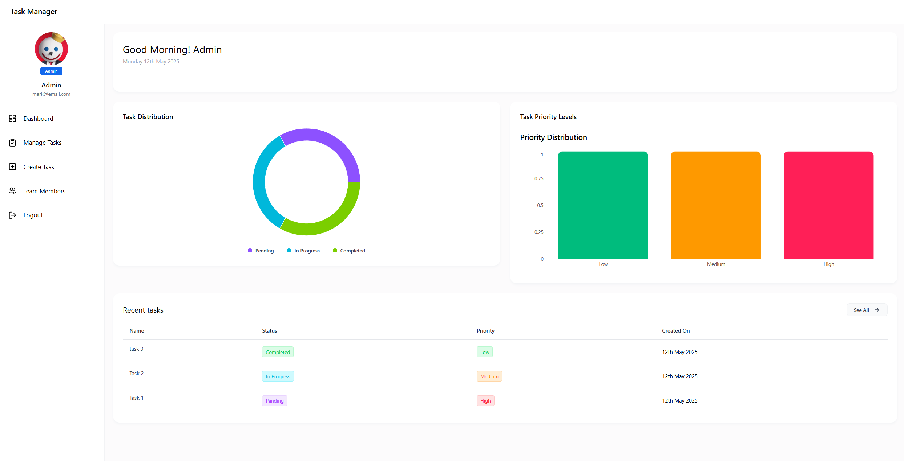
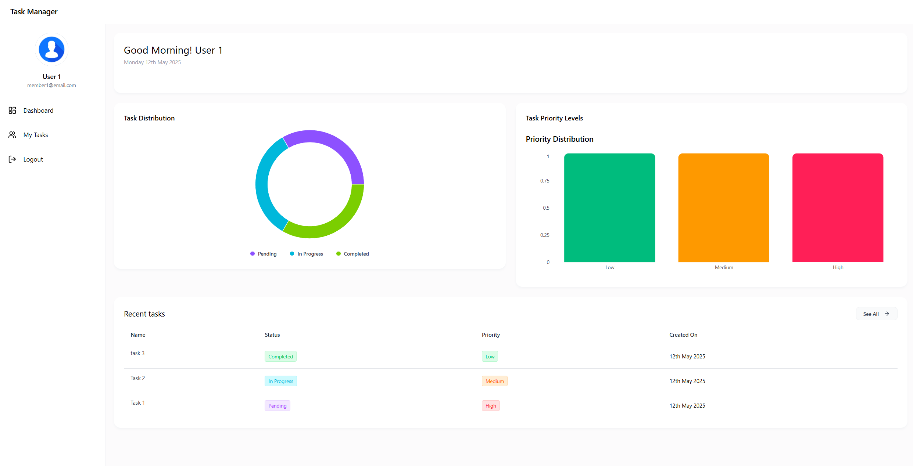

# 🧠 Task Manager

A powerful full-stack Task Management System built using **React**, **TailwindCSS**, **Vite**, **Express**, and **MongoDB**.

> Created by **Ahmad Osama** and **Marko Emil**

---

## 🚀 Features

- 🔐 JWT-based Authentication
- 👤 Admin & User Roles with Protected Routes
- 📋 Task Creation, Assignment & Management (Admin)
- ✅ Task View and Completion (User)
- 📊 Role-based Dashboards
- 📈 Report Generation
- 📱 Responsive UI

---

## 🖼️ Preview

---

## 🛠️ Tech Stack

- **Frontend**: React, Vite, TailwindCSS
- **Backend**: Node.js, Express.js
- **Database**: MongoDB Atlas
- **Authentication**: JWT
- **Routing**: React Router
- **UX Enhancements**: React Hot Toast, Axios
